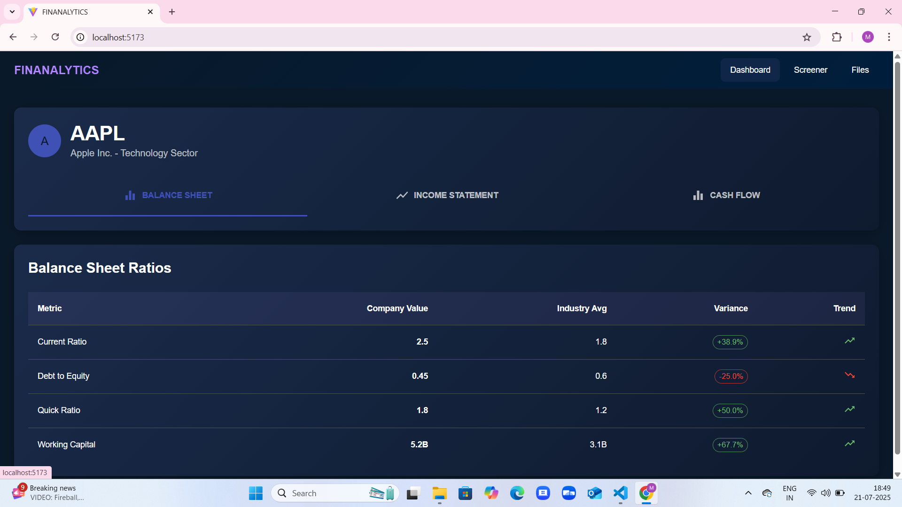
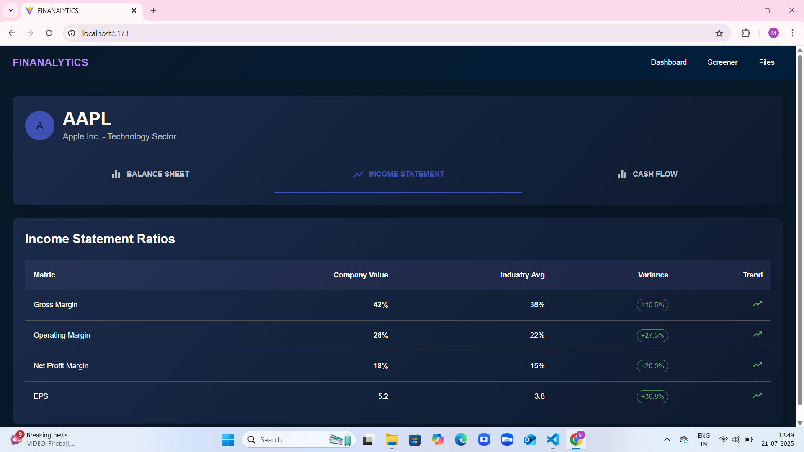
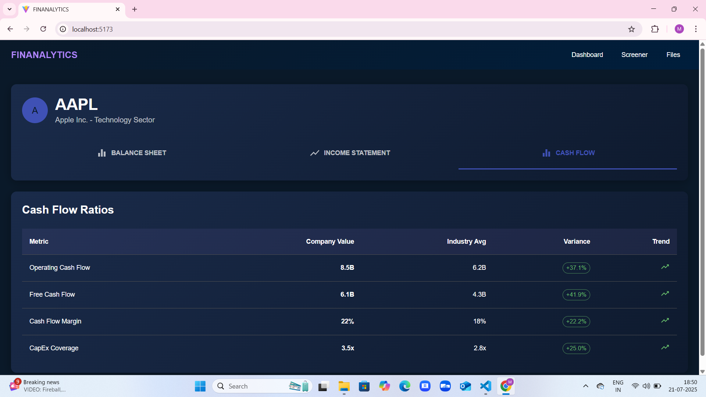
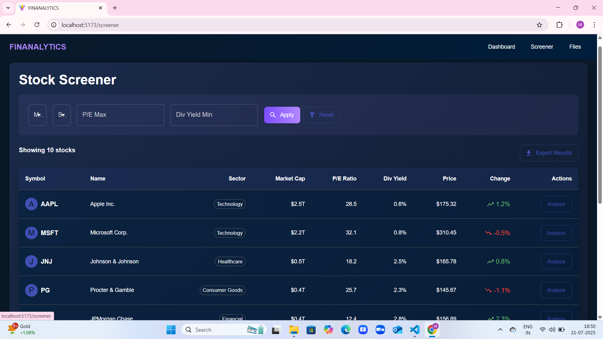
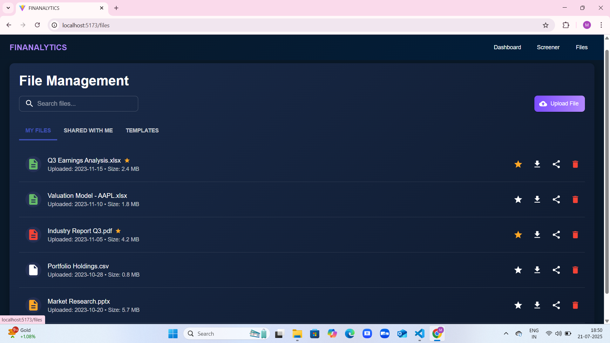
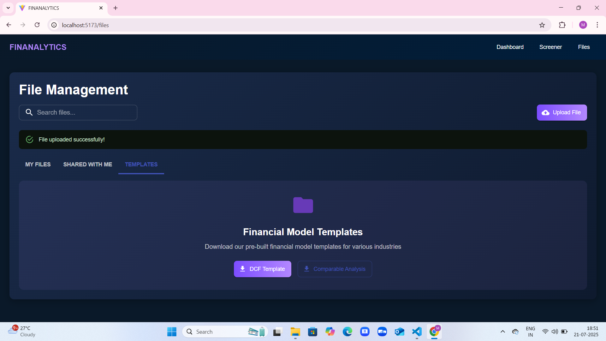
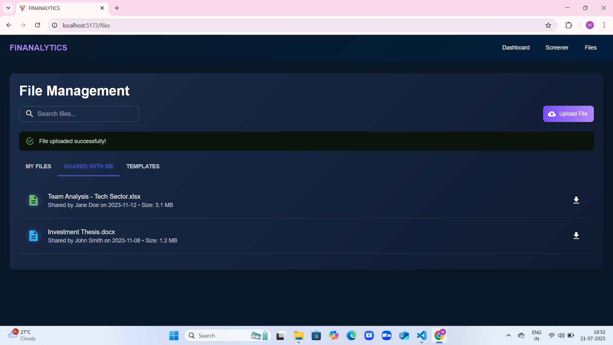

# 📈 Stock Analytics Dashboard


## 🌟 Overview

**Stock Analytics Dashboard** is a powerful, interactive platform that combines visual financial intelligence with enterprise-grade tools for investors and analysts. Built using **React.js** and **FastAPI**, it enables seamless exploration of financial statements, screening capabilities, and smart file management.

---

## ✨ Key Features

### 📊 1. Stock Ratio Dashboard

Analyze a company’s Balance Sheet, Income Statement, and Cash Flow with variance indicators and trend visualizations.

#### 🧾 Balance Sheet Ratios  


#### 💰 Income Statement Ratios  


#### 💸 Cash Flow Ratios  


---

### 🔍 2. Stock Screener

Easily discover and analyze stocks based on market cap, P/E ratio, dividend yield, and other customizable filters.



---

### 📁 3. File Management System

Organize, upload, and download critical financial reports and templates. Features include:
- ⭐ Mark as important
- 📤 Upload with success notifications
- 📂 Prebuilt templates for DCF and comparable analysis

#### 📂 My Files


#### 📥 Templates Section


#### 🤝 Shared With Me


---

## 🛠️ Tech Stack

### Frontend
- **React.js** – Component-based architecture
- **Material-UI** – For rich and responsive UI
- **React Router** – Navigation
- **Axios** – API communication

### Backend
- **FastAPI** – Fast, modern Python-based API
- **Pydantic** – Data parsing and validation
- **Custom Python Modules** – Financial logic

### Data Sources
- Yahoo Finance, Alpha Vantage APIs
- Internal CSV processing and ingestion pipelines

---

## 🚀 Getting Started

### ⚙️ Prerequisites
- Node.js (v14+)
- Python (3.8+)
- npm or yarn

### 🧩 Setup

```bash
# Clone the repository
git clone https://github.com/yourusername/stock-analytics-dashboard.git
cd stock-analytics-dashboard

# Install frontend dependencies
cd frontend
npm install
npm start

# Install backend dependencies and run server
cd ../backend
pip install -r requirements.txt
uvicorn main:app --reload
